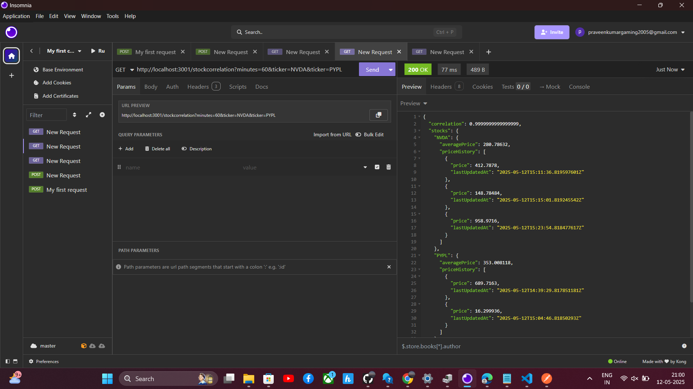
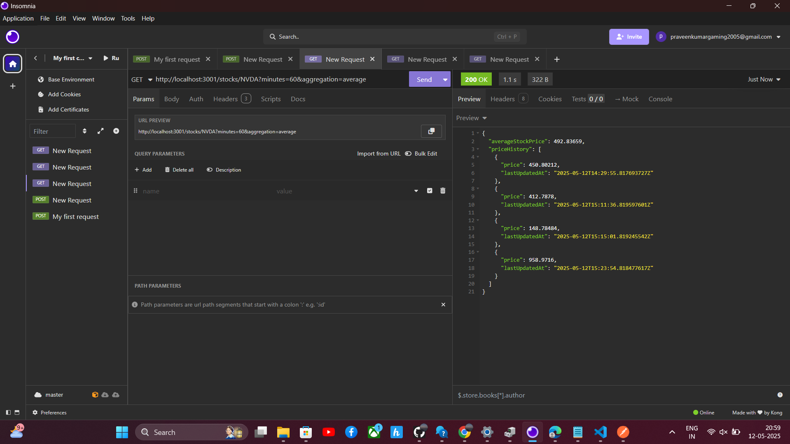

# Ch.en.u4aie22048
Affordmed Full Stack Evaluation – Ch.en.u4aie22048
This repository contains my submission for the Affordmed Full Stack Hiring Challenge. It includes a backend microservice for stock price aggregation and a responsive frontend dashboard built using React and Material UI.

Folder Structure

Ch.en.u4aie22048/
├── Question1/    # Backend - Node.js + Express
├── Question2/    # Frontend - React + Material UI

 Tech Stack
✅ Backend (Question 1)
Node.js
Express.js
Axios
Pearson Correlation (Custom Implementation)

✅ Frontend (Question 2)
React
Material UI (MUI)
Axios
Chart.js

 Output Screenshots
📌 Question 1: API Test Results (Insomnia)

📌 Question 2: Frontend UI

 
 
 
 
 
 
